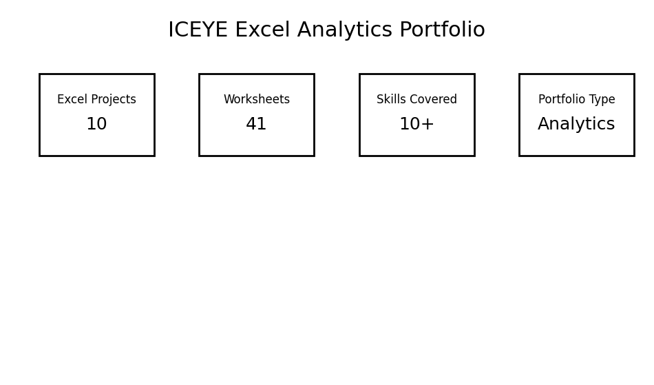
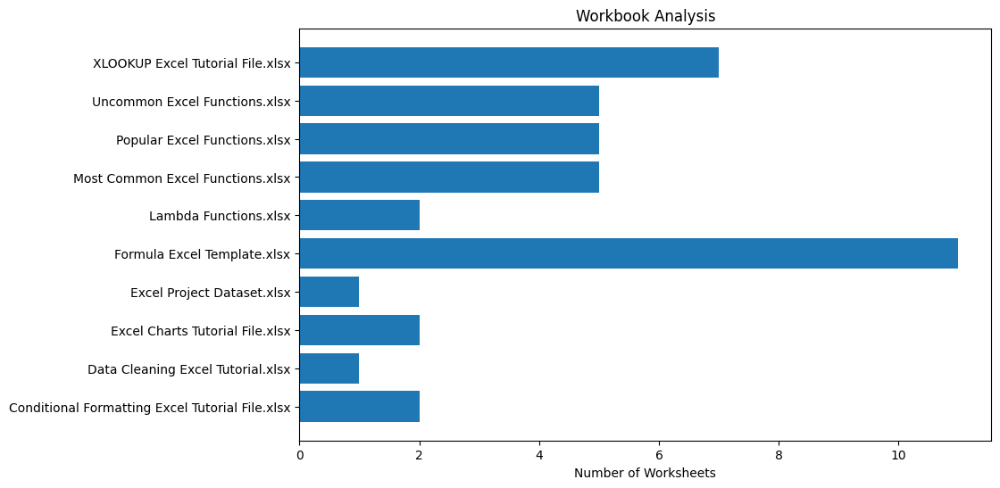

# excel-analytics-reporting
# Excel Analytics Portfolio

## Project Overview

This repository contains multiple Excel analytics projects focused on business reporting, operational analytics, dashboard development, and advanced Excel data analysis techniques.

The portfolio demonstrates practical hands-on experience with:
- Data cleaning
- Dashboard creation
- Pivot Tables
- Business reporting
- KPI analysis
- Advanced Excel formulas
- Data visualization

This project portfolio was built to strengthen practical analytics skills relevant for operational, reporting, and data-focused roles.

---

# Skills Demonstrated

## Excel Analytics Skills
- Pivot Tables
- Pivot Charts
- Dashboard Design
- Conditional Formatting
- XLOOKUP
- LAMBDA Functions
- Advanced Excel Formulas
- Data Cleaning
- Data Visualization
- Business Reporting

## Analytics Skills
- KPI Tracking
- Operational Analytics
- Sales Analysis
- Trend Analysis
- Reporting Automation
- Data-Driven Decision Making

---

# Repository Structure

| File Name | Description |
|---|---|
| `Conditional Formatting Excel Tutorial File.xlsx` | Conditional formatting practice and highlighting business metrics |
| `Data Cleaning Excel Tutorial.xlsx` | Data cleaning and transformation workflows |
| `Excel Charts Tutorial File.xlsx` | Business chart creation and visualization |
| `Excel Project Dataset.xlsx` | Main business analytics dataset |
| `Formula Excel Template.xlsx` | Formula calculations and reporting |
| `Lambda Functions.xlsx` | Advanced LAMBDA function implementation |
| `Most Common Excel Functions.xlsx` | Core Excel functions for analytics |
| `Popular Excel Functions.xlsx` | Frequently used business formulas |
| `Uncommon Excel Functions.xlsx` | Advanced and uncommon Excel functions |
| `XLOOKUP Excel Tutorial File.xlsx` | XLOOKUP implementation and lookup analytics |

---

# Key Insights

## Technical Insights
- Improved dashboard creation and reporting workflows.
- Practiced advanced Excel functions used in business analytics.
- Built understanding of operational and reporting processes.
- Strengthened analytical thinking using structured datasets.

## Business Insights
- Learned how to transform raw data into actionable insights.
- Developed reporting structures for decision-making.
- Improved understanding of KPI tracking and business performance monitoring.

---

# Screenshots

## Dashboard Overview

## Workbook Analysis

## Pivot Table Skills

## Excel Skills Summary

---

# Tools & Technologies

- Microsoft Excel
- Pivot Tables
- Pivot Charts
- Conditional Formatting
- XLOOKUP
- LAMBDA Functions
- Data Visualization
- Business Analytics
- Reporting Dashboards

---

# Why This Portfolio Matters

This repository demonstrates practical analytics and reporting skills used in real-world business environments.

It showcases the ability to:
- Work with structured datasets
- Clean and organize business data
- Build dashboards and reports
- Create analytical summaries
- Support operational decision-making
- Present business insights visually

---

# Future Improvements

Potential future improvements include:
- Power BI dashboard integration
- SQL-based reporting workflows
- Python automation for analytics
- ETL pipeline development
- Advanced KPI dashboards

---

# About Me

I am currently building my career in Data Analytics and Data Engineering with strong interest in:
- Operational analytics
- Business reporting
- Data visualization
- Reporting automation
- Data-driven decision making

This repository is part of my practical portfolio focused on solving real-world business problems using analytics and reporting tools.
